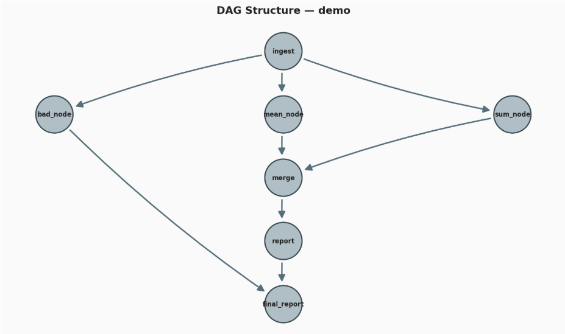
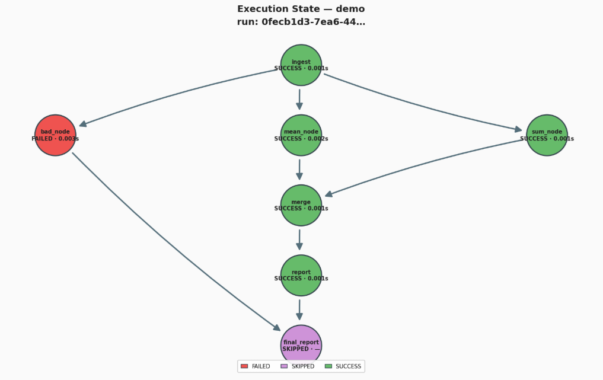

# DAG-Based Workflow Execution Engine

Single machine DAG workflow engine that executes tasks based on dependencies, propogates strcutures data between them, supports parallel execution and enables partial re-execution.

This project is focused for understanding of complex workflow orchestrators - not for anything prod

### Structure Visualisation



### Execution Visualisation



## Setup

```powershell
python -m venv dag-env
.\dag-env\Scripts\activate
pip install -r requirements.txt
```

### Server Initiation:

```
uvicorn api.main:app [--reload]
```

## Core

### 1. Graph Management Layer

This layer creates and manages DAG structures.

- It supports adding/removing nodes
- It supports adding/removing directed edges (dependencies)
- It validates DAG integrity

### 2. Execution Engine

This engine orchestrates node execution.

- It performs topological sorting
- It executes nodes when dependencies are satisfied
- It supports parallel execution of independent nodes

Node lifecycle states include:

- `PENDING`
- `RUNNING`
- `SUCCESS`
- `FAILED`

### 3. Data Flow System

This system handles data propagation between nodes.

- Each node receives inputs only from its dependencies
- Outputs are structured JSON
- There is no shared global mutable state

Rules:

- Nodes only access outputs of upstream nodes
- Inputs are deterministic and reproducible

### 4. Node Abstraction Layer

This layer defines a standardized task interface:

```

execute(inputs) → output

```

- It supports custom node implementations
- It ensures stateless execution
- It allows easy extensibility

### 5. Execution State Store

This component persists execution state and outputs.

It stores:

- Node status
- Node outputs
- Execution metadata (timestamps, retries)

It enables:

- retries
- partial re-execution

### 6. Error Handling & Retry Logic

This component handles failures safely.

- It isolates node failures
- It prevents downstream execution on failure
- It supports manual retry of failed nodes

### 7. Partial Re-execution

This feature recomputes only necessary parts of the graph.

- It re-runs from a failed or selected node
- It automatically re-runs all affected downstream nodes
- It avoids recomputing unaffected nodes

## System Flow

```

User defines DAG
↓
Graph Validation (cycle detection)
↓
Execution Engine
↓
Node Execution (parallel where possible)
↓
State Store (status + outputs)
↓
Next eligible nodes triggered

```

```

```
